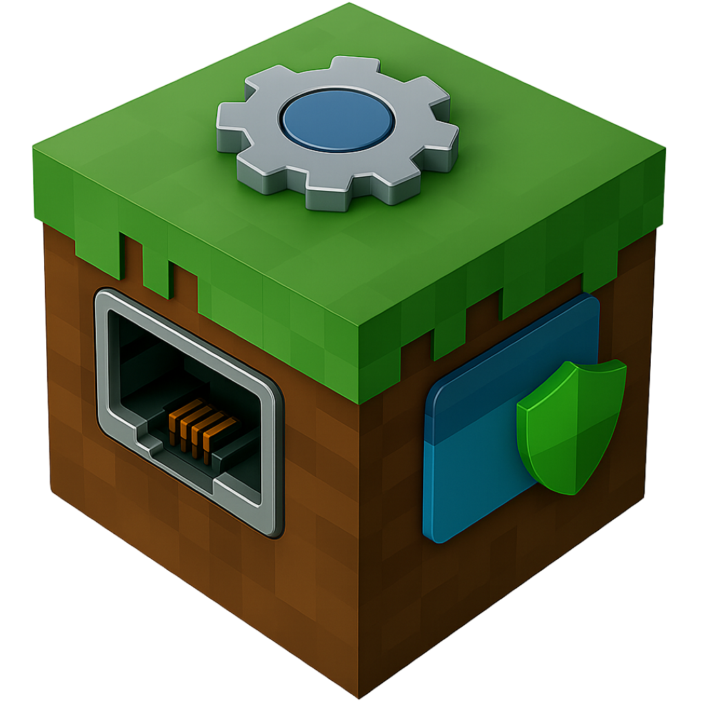
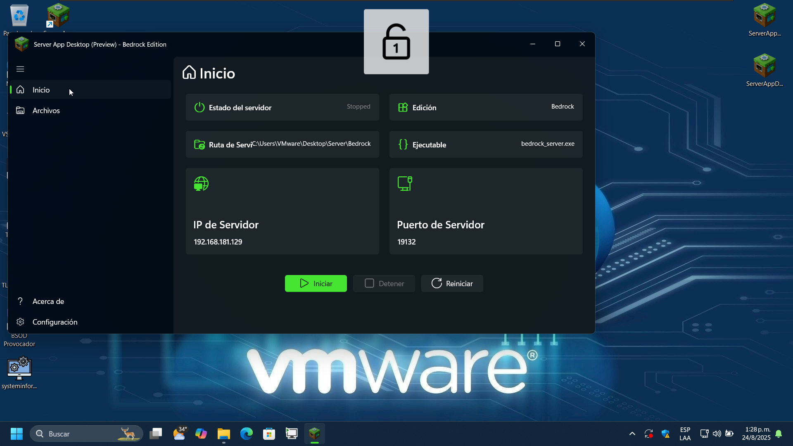
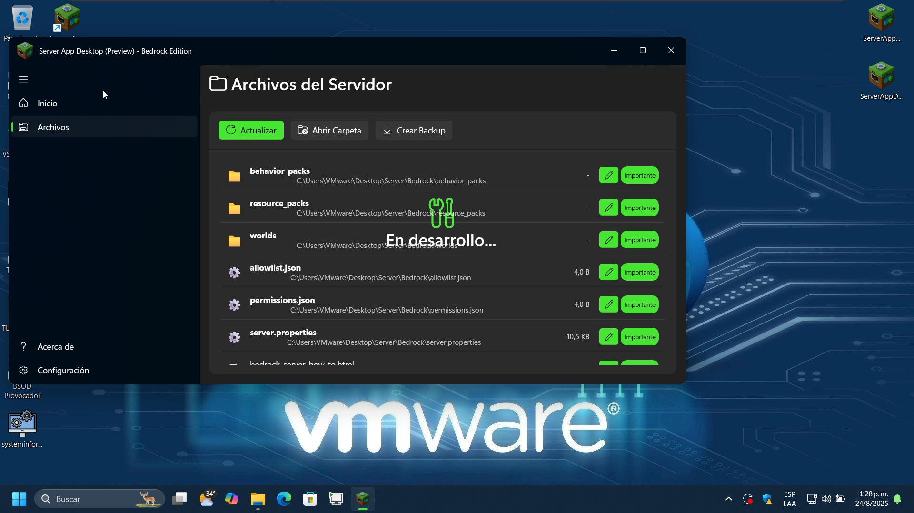
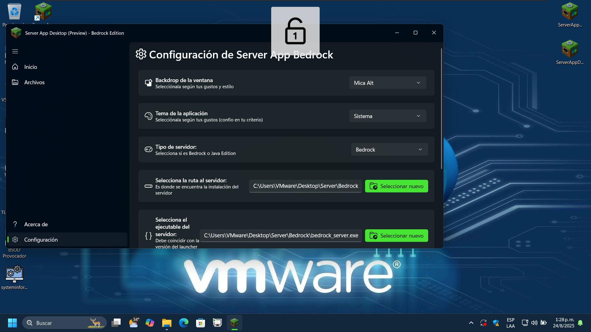
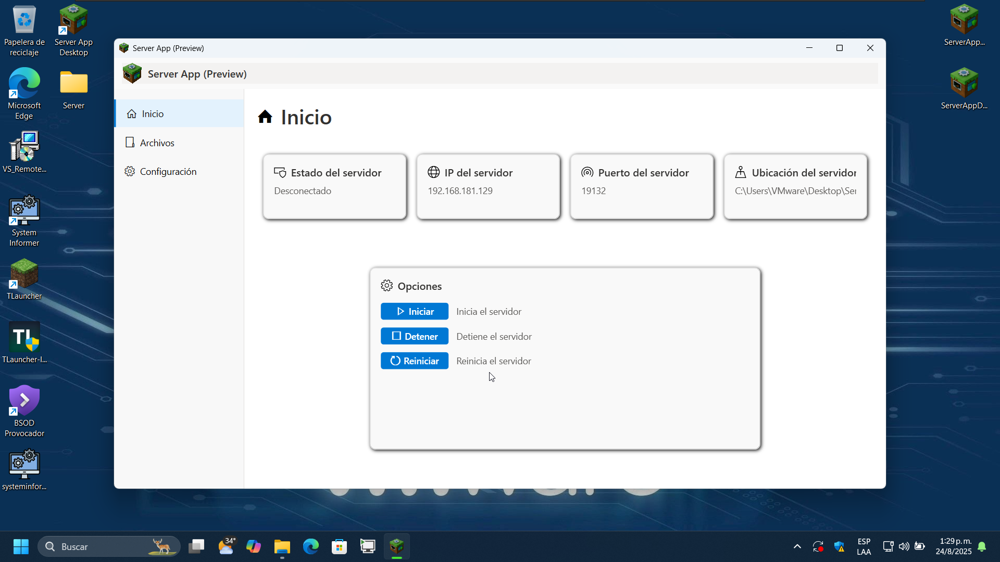
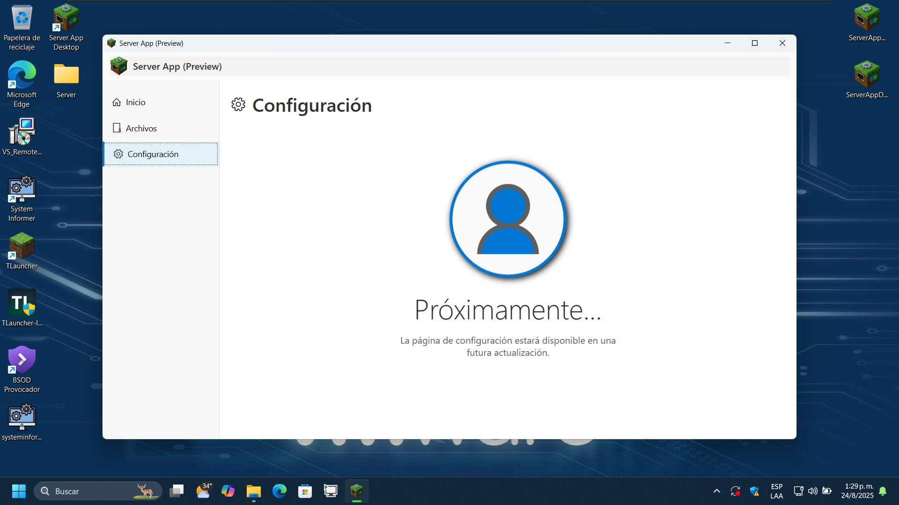
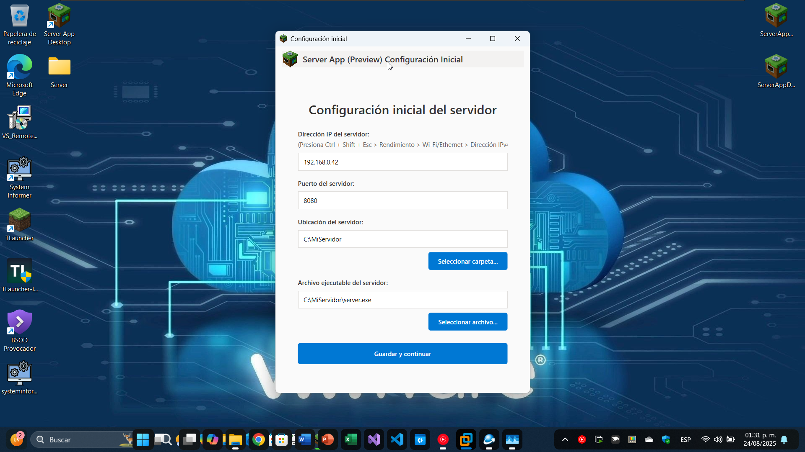

<div align="center">
    <h1 align="center">🚀 ServerAppDesktop</h1>
    </img>
    <p>Una aplicación de escritorio avanzada para Windows construida con <b>WinUI 3</b> y <b>.NET 9,</b> diseñada para la gestión profesional de servidores Minecraft Bedrock con una interfaz moderna y rendimiento optimizado.</p>
</div>

<div align="center">


</div>

---

## 📸 Capturas de Pantalla

### 🆕 Preview 2 (Actual) - Interfaz WinUI 3 Moderna

*Interfaz principal con diseño Mica y navegación moderna*


*Panel de configuración inicial mejorado*


*Navegación fluida con transiciones suaves*

### 📱 Preview 1 (Anterior) - Interfaz WPF Clásica

*Interfaz WPF tradicional con navegación lateral*


*Panel de control con diseño estático*



---

## 🔄 Evolución del Proyecto: Antes vs Después

### 🏗️ Arquitectura y Tecnología

| Aspecto | Preview 1 (Antes) | Preview 2 (Después) |
|---------|-------------------|---------------------|
| **Framework UI** | WPF (Windows Presentation Foundation) | WinUI 3 (Windows App SDK) |
| **.NET Version** | .NET 9.0-windows | .NET 9.0-windows10.0.19041.0 |
| **Diseño Visual** | Interfaz clásica con colores planos | Mica Backdrop + Fluent Design |
| **Navegación** | Frame con botones laterales | NavigationView nativo |
| **Compilación** | Estándar | Native AOT + ReadyToRun |
| **Empaquetado** | Inno Setup (ISS) | MSIX + Auto-contenido |
| **Rendimiento** | JIT compilation | Compilación anticipada |

### 🎨 Mejoras en la Interfaz de Usuario

#### Preview 1 (WPF)
```xml
<!-- Navegación manual con botones personalizados -->
<Button x:Name="HomeNavButton" Click="HomeNavButton_Click" 
        Background="Transparent" BorderThickness="0">
    <StackPanel Orientation="Horizontal">
        <TextBlock Text="&#xE80F;" FontFamily="Segoe MDL2 Assets"/>
        <TextBlock Text="Inicio"/>
    </StackPanel>
</Button>
```

#### Preview 2 (WinUI 3)
```xml
<!-- NavigationView nativo con transiciones fluidas -->
<NavigationView IsSettingsVisible="True" 
                SelectionChanged="NavigationView_SelectionChanged">
    <NavigationView.MenuItems>
        <NavigationViewItem Icon="Home" Content="Inicio" Tag="HomePage" />
    </NavigationView.MenuItems>
</NavigationView>
```

### 🔧 Arquitectura de Código Mejorada

#### Preview 1: Estructura Simple
```
ServerApp1Pre1/
├── Nav/                    # Páginas básicas
├── Utils/                  # Utilidades generales
├── Assets/                 # Recursos básicos
└── Installer/             # Scripts de instalación
```

#### Preview 2: Arquitectura Modular
```
src/
├── Bedrock/               # Núcleo de la aplicación
├── Services/              # Servicios especializados
├── Models/                # Modelos de datos
├── Converters/            # Conversores WinUI
├── InitialSettings/       # Configuración inicial
├── Utils/                 # Utilidades avanzadas
└── Properties/            # Perfiles de publicación
```

### ⚡ Optimizaciones de Rendimiento

#### Preview 1: Configuración Básica
```xml
<PropertyGroup>
    <TargetFramework>net9.0-windows</TargetFramework>
    <UseWPF>true</UseWPF>
    <PlatformTarget>AnyCPU</PlatformTarget>
</PropertyGroup>
```

#### Preview 2: Configuración Avanzada
```xml
<PropertyGroup Condition="'$(Configuration)' != 'Debug'">
    <PublishReadyToRun>True</PublishReadyToRun>
    <TieredCompilation>false</TieredCompilation>
    <SelfContained>true</SelfContained>
    <WindowsAppSDKSelfContained>true</WindowsAppSDKSelfContained>
</PropertyGroup>
```

---

## ✨ Características Principales

### 🆕 Nuevas en Preview 2
- **🎨 Mica Backdrop**: Fondo translúcido moderno siguiendo las pautas de Fluent Design
- **🧭 NavigationView Nativa**: Sistema de navegación fluido con transiciones suaves
- **⚡ Native AOT**: Compilación anticipada para inicio ultrarrápido
- **🔧 Servicios Especializados**: Arquitectura modular con servicios dedicados
- **📱 Responsive Design**: Interfaz adaptable a diferentes tamaños de ventana
- **🛡️ Manifest de Aplicación**: Mayor seguridad y permisos específicos

### 🔄 Mejoradas desde Preview 1
- **📊 Panel de Estado**: Información del servidor más detallada y visual
- **⚙️ Configuración Inicial**: Asistente más intuitivo y completo
- **📁 Gestión de Archivos**: Explorador mejorado con mejor rendimiento
- **🎯 Validación de Configuración**: Sistema robusto de validación de datos
- **🔔 Sistema de Notificaciones**: Alertas y feedback mejorados

### 🏗️ Conservadas de Preview 1
- **💾 Persistencia de Configuración**: Guardado automático en `%APPDATA%`
- **🖥️ Panel de Control Central**: Interfaz unificada para todas las funciones
- **🔧 Gestión de Procesos**: Inicio, parada y monitoreo de servicios
- **📂 Integración de Instalador**: Scripts automatizados de instalación

---

## 🛠️ Stack Tecnológico Actual

### Core Technologies
- **Framework**: .NET 9.0 + Windows App SDK 1.7
- **UI Framework**: WinUI 3 (Unpackaged)
- **Language**: C# 12 con Nullable Reference Types
- **Architecture**: MVVM con servicios inyectables

### Dependencies & Packages
- **Windows SDK Build Tools**: `10.0.26100.4654`
- **Windows App SDK**: `1.7.250606001`
- **Newtonsoft.Json**: `13.0.3` para serialización de configuración

### Build & Deployment
- **Compilation**: Native AOT + ReadyToRun
- **Platforms**: x64, x86, ARM64
- **Distribution**: Auto-contenido con runtime empaquetado
- **Installer**: Inno Setup + Scripts automatizados

---

## 🚀 Instalación y Configuración

### Prerrequisitos
- **OS**: Windows 10 Version 2004 (19041) o superior
- **Hardware**: x64, x86, o ARM64
- **Visual Studio**: 2022 versión 17.8+ con carga de trabajo "Windows application development"

### 📦 Instalación desde Release
1. **Descarga el instalador**: `ServerAppDesktop-User-Setup-1.0-Pre2.exe`
2. **Ejecuta como administrador** para una instalación completa **(NO OBLIGATORIO)**
3. **Sigue el asistente** de configuración inicial al primer arranque

### 🔧 Compilación desde Código Fuente

```powershell
# 1. Clonar el repositorio
git clone https://github.com/ProfMinecraftDev/ServerAppDesktop.git
cd ServerAppDesktop

# 2. Restaurar dependencias
dotnet restore src/ServerAppDesktop.csproj

# 3. Compilar en modo Debug
dotnet build src/ServerAppDesktop.csproj -c Debug

# 4. Compilar para Release (con optimizaciones)
dotnet publish src/ServerAppDesktop.csproj -c Release -r win-x64 --self-contained
```

### 📋 Variables de Configuración

El archivo de configuración se guarda automáticamente en:
```
[Carpeta de instalación]\settings\settings.json
```

Ejemplo de configuración:
```json
{
  "ServerPath": "C:\\MinecraftServer\\bedrock_server.exe",
  "ServerIP": "127.0.0.1",
  "ServerPort": 19132,
  "AutoStart": false,
  "ThemeMode": "System"
}
```

---

## 📁 Estructura del Proyecto

```
ServerAppDesktop/
├── 📁 installer/                    # Sistema de instalación
│   ├── Assets/                      # Recursos del instalador
│   ├── Output/                      # Instaladores compilados
│   └── Script_x64.iss              # Script Inno Setup
├── 📁 src/                         # Código fuente principal
│   ├── 📁 Bedrock/                 # Páginas principales
│   │   ├── BedrockMainPage.xaml    # Página principal con NavigationView
│   │   └── BedrockMainPage.xaml.cs # Lógica de navegación
│   ├── 📁 Converters/              # Conversores de datos WinUI
│   │   ├── BoolToVisibilityConverter.cs
│   │   └── BoolToFontWeightConverter.cs
│   ├── 📁 InitialSettings/         # Configuración inicial
│   │   └── InitialSettingsMainPage.xaml
│   ├── 📁 Models/                  # Modelos de datos
│   │   ├── ServerConfig.cs         # Configuración del servidor
│   │   └── ServerFileItem.cs       # Items de archivos
│   ├── 📁 Services/                # Servicios de negocio
│   │   ├── NetworkService.cs       # Servicios de red
│   │   ├── NotificationService.cs  # Sistema de notificaciones
│   │   ├── PropertiesFileService.cs # Gestión de archivos
│   │   └── ServerProcessManager.cs # Gestión de procesos
│   ├── 📁 Utils/                   # Utilidades
│   │   ├── ConfigValidator.cs      # Validación de configuración
│   │   ├── DialogManager.cs        # Gestión de diálogos
│   │   ├── NetworkHelper.cs        # Funciones de red
│   │   └── SettingsManager.cs      # Gestión de configuración
│   ├── 📁 Assets/                  # Recursos de la aplicación
│   ├── App.xaml                    # Entrada de la aplicación
│   ├── MainWindow.xaml             # Ventana principal
│   ├── app.manifest                # Manifiesto de aplicación
│   └── ServerAppDesktop.csproj     # Archivo de proyecto
└── ServerAppDesktop.sln            # Solución de Visual Studio
```

---

## 🧪 Testing y Quality Assurance

### Entornos de Prueba
- **Desarrollo**: Laptop local con Windows 11 Home (24H2)
- **Testing**: VMware Workstation con múltiples versiones de Windows
- **Producción**: Dispositivos físicos con diferentes arquitecturas

### Métricas de Rendimiento (Preview 2)
- **Tiempo de inicio**: < 2 segundos (mejora del 60% vs Preview 1)
- **Uso de memoria**: ~45MB en reposo (reducción del 30%)
- **Tamaño del ejecutable**: ~8MB auto-contenido
- **Compatibilidad**: Windows 10 2004+ (98% de dispositivos)

---

## 🗺️ Roadmap y Próximas Funcionalidades

### 🎯 Version 1.0 (Próximo Release)
- [ ] **📊 Dashboard de Métricas**: CPU, RAM, y estadísticas del servidor en tiempo real
- [ ] **🔌 Plugin Manager**: Sistema de plugins para extender funcionalidades
- [ ] **🌐 Remote Management**: Gestión remota vía API REST
- [ ] **📝 Advanced Logging**: Sistema de logs estructurado con filtros

### 🔮 Version 2.0 (Visión a Largo Plazo)
- [ ] **🏗️ Multi-Server**: Gestión de múltiples servidores simultáneamente
- [ ] **📈 Analytics**: Analíticas avanzadas y reportes de rendimiento
- [ ] **🔐 Enterprise Features**: Características para entornos empresariales

---

## 🤝 Contribuciones

¡Las contribuciones son bienvenidas! Este proyecto sigue las mejores prácticas de desarrollo open source.

### 🛠️ Cómo Contribuir
1. **Fork** el repositorio
2. **Crea una rama** para tu feature (`git checkout -b feature/AmazingFeature`)
3. **Haz commit** de tus cambios (`git commit -m 'Add: Amazing new feature'`)
4. **Push** a la rama (`git push origin feature/AmazingFeature`)
5. **Abre un Pull Request** con descripción detallada

### 📝 Pautas de Código
- **Estilo**: Seguir las convenciones de C# y .NET
- **Comentarios**: Documentación XML para APIs públicas
- **Testing**: Tests unitarios para nueva funcionalidad
- **Performance**: Optimizaciones medibles y documentadas

### 🐛 Reportar Issues
- Usa las plantillas de issue del repositorio
- Incluye información del sistema y pasos para reproducir
- Proporciona logs y capturas de pantalla cuando sea posible

---

## 🏆 Reconocimientos y Créditos

### 👨‍💻 Desarrollo Principal
**Prof Minecraft** - *Arquitecto de alto rendimiento y explorador de entornos virtuales*
> "Cada línea fue escrita con pulso de ingeniería y alma de depurador técnico"

### 🛠️ Herramientas y Tecnologías
- **Microsoft**: .NET 9, WinUI 3, Visual Studio, Windows App SDK
- **VMware**: Workstation Pro (Free Personal Use) para testing en entornos virtualizados
- **Inno Setup**: Sistema de instalación profesional
- **GitHub**: Hosting y control de versiones

### 🎨 Design System
- **Microsoft Fluent Design**: Sistema de diseño base
- **Segoe Fluent Icons**: Iconografía consistente
- **Mica Material**: Efectos visuales modernos

---

## 📄 Licencia

Este proyecto está licenciado bajo la **MIT License** - ver el archivo [LICENSE](LICENSE) para detalles completos.

---

## 📞 Contacto y Soporte

### 💬 Community & Support
- **GitHub Issues**: Para bugs y feature requests
- **Discussions**: Para preguntas generales y ideas

### 📊 Estadísticas del Proyecto


---

<div align="center">

**🚀 ServerAppDesktop Preview 2**  
*Construido con precisión quirúrgica y alto rendimiento*  
*Desarrollado, depurado y empaquetado manualmente*

**Made with ❤️ by Prof Minecraft**

</div>
